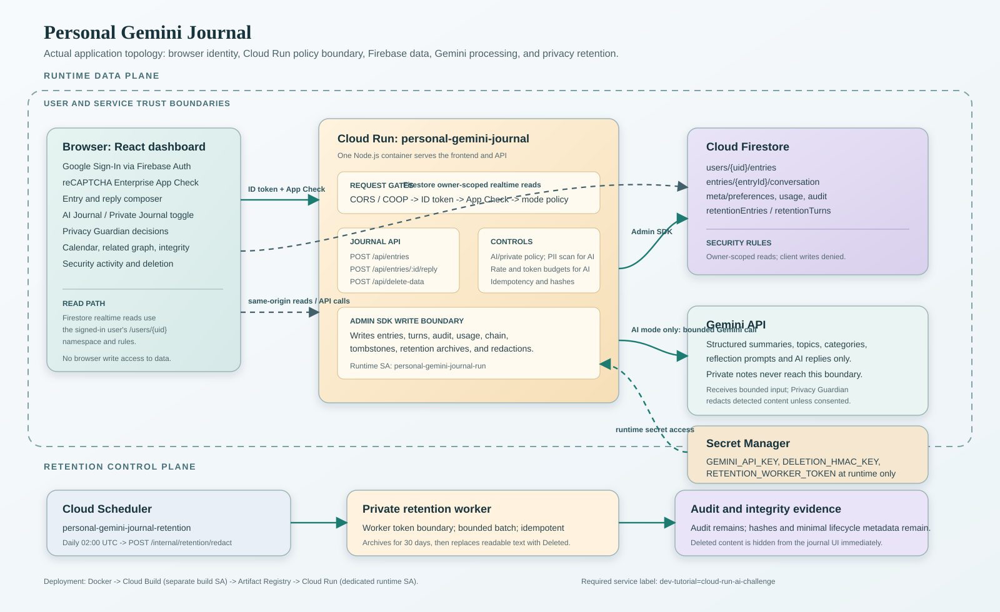

# Personal Gemini Journal

Personal Gemini Journal is a user-authenticated journaling application built for the [Google Cloud Gen AI Academy APAC Edition, Cohort 3](https://hack2skill.com/event/apac-genaiacademy?tab=cohort3&utm_source=hack2skill&utm_medium=homepage) ideathon, focused on Accelerate AI with Cloud Run. It combines Google Sign-In, Gemini-assisted reflection, private Firestore storage, and deterministic privacy and integrity controls.

The central design rule is simple: **Gemini interprets journal content, but it never decides authorization, privacy policy, or what gets persisted.**

For version 1, the accurate security claim is:

> Journal data is isolated per authenticated user and protected from unauthorized application clients. Privileged Google Cloud operators and the backend runtime remain trusted components.

This is an intentional trusted-backend model. Firebase Authentication, Firestore Security Rules, and App Check protect the application boundary and user-to-user isolation; they do not prevent a sufficiently privileged Google Cloud operator or the Cloud Run runtime identity from reading Firestore data. The practical hardening priority is restricting human IAM access, removing unnecessary `roles/editor` after Policy Simulator review, separating deployer and auditor roles, and retaining access audit logs.

For the complete evaluator-facing feature inventory, evidence matrix, architecture map, and honest production boundaries, read [EVALUATION_DOSSIER.md](docs/EVALUATION_DOSSIER.md).

## Current capabilities

- Google Sign-In through Firebase Authentication; the application does not handle passwords.
- Popup sign-in with redirect fallback, persistent browser-local auth state through Firebase, and explicit sign-out.
- Each authenticated account receives a Firebase user ID (`uid`) that is used as the ownership boundary for every user-scoped path.
- User-controlled AI Journal / Private Journal mode is persisted per user; Private Journal saves the entry without any Gemini call or AI reply.
- Entry input is bounded to 8,000 characters; replies are bounded to 2,000 characters.
- Idempotent entry and reply requests use client-generated request IDs.
- Multi-turn conversations scoped to one journal entry.
- Server-side Privacy Guardian scanning for secrets and PII before every Gemini call, including replies.
- Explicit Redact or Send as-is choice when sensitive content is detected. The modal closes immediately after either decision.
- Storage segregation keeps RAW user text, DERIVED Gemini output, conversation turns, audit events, usage metadata, hash-chain state, and backend-only retention records in separate user-scoped paths.
- RAW user text stored separately from clearly labeled DERIVED Gemini output.
- Six-model Gemini fallback ladder with three bounded structured-output attempts per model, at most 18 structured attempts total.
- Structured Gemini output includes a summary, up to five topics, one or two fixed categories, and a reflection question.
- Per-user request rate limiting, daily token budgets, input limits, and bounded conversation context.
- Firestore-backed SHA-256 hash chains for entries and conversation turns, with server-side rehash/recalculation through the integrity-verification endpoint. The UI distinguishes total server records verified, entries pending retention redaction, and entries still visible in the journal.
- Read-only security activity panel showing the signed-in user's recent audit events.
- Closed-set category clustering and relationships show related entries that share an allowlisted category; this is not vector or semantic search.
- Calendar v1 is derived from the realtime entry list, with month navigation, Today, entry counts, and jump-to-entry behavior. Deleting an entry removes its calendar marker automatically; no second calendar record exists.
- Individual entry deletion removes one journal entry from the visible UI immediately, archives its full record in backend-only retention storage for up to 30 days, then redacts its journal text while preserving minimal chain and audit metadata.
- Delete-all-journal removes every visible entry and conversation for the signed-in user in one operation, preserves the audit trail, archives protected records, and applies the same delayed redaction lifecycle.
- Firebase App Check support for the custom Express API, with explicit production enforcement and a fail-closed client token path.
- Secret Manager supplies the Gemini API key, deletion HMAC key, and retention worker token to Cloud Run at runtime; these values are not included in the frontend bundle or Docker build arguments.
- OWASP LLM Top 10 controls are mapped with implemented evidence and known limits in [OWASP_LLM_TOP10_COVERAGE.md](docs/OWASP_LLM_TOP10_COVERAGE.md).
- Repeatable Docker-to-Cloud-Run provisioning through `scripts/provision-cloud-run.ps1`: separate user-managed build/runtime identities, least-privilege IAM, App Check build/runtime configuration, Secret Manager bindings, challenge label, and daily retention scheduler.

## Version 1 feature inventory

| Capability | What the implementation provides |
| --- | --- |
| Google account sign-in | Firebase Authentication with Google Sign-In, popup flow, redirect fallback, persistent browser-local state, and explicit sign-out. |
| Per-user identity | Firebase assigns a unique `uid`; API authorization and Firestore paths are derived from the verified token UID, never from a client-supplied owner field. |
| AI processing choice | A server-enforced per-user preference lets new entries use the full Gemini flow or save as Private Journal entries without Gemini, token usage, summaries, categories, reflections, or replies. |
| App Check | Score-based reCAPTCHA Enterprise attestation is sent in `X-Firebase-AppCheck` and verified server-side on protected Express API routes. |
| Storage segregation | Active entries, conversations, audit events, usage, hash-chain state, and backend-only retention records use separate `users/{uid}/...` paths. |
| Privacy Guardian | Deterministic sensitive-content interception occurs before Gemini; the user chooses Redact before sending to Gemini or Send as-is anyway. |
| Delete one entry | A single entry is hidden immediately, tombstoned for chain continuity, archived for up to 30 days, and then privacy-redacted. |
| Delete all entries | The complete visible journal is removed in one operation while audit records remain and protected retention records follow the same lifecycle. |
| Hash and rehash | SHA-256 entry and conversation chains preserve `hash` and `prevHash`; integrity verification recalculates the server-side chain. |
| Calendar | Calendar v1 is derived from the live journal entries, so deleting an entry automatically removes its calendar marker. |
| Security Activity | Read-only user-scoped audit events expose security-relevant activity without allowing client writes or deletion. |
| Secret Manager | Gemini, deletion-HMAC, and retention-worker secrets are injected into Cloud Run at runtime through Secret Manager references. |
| OWASP LLM Top 10 | The control mapping, evidence, residual risks, and manual verification boundaries are recorded in [OWASP_LLM_TOP10_COVERAGE.md](docs/OWASP_LLM_TOP10_COVERAGE.md). |

## Architecture



The versioned [architecture diagram](docs/ARCHITECTURE.svg) is based on the current source paths and Cloud Run deployment. It shows the separate identity, App Check, API, Gemini, Firestore, Secret Manager, and retention boundaries without including project secrets.

```text
Browser
  Firebase Auth + Google Sign-In
  Firebase App Check token
  Firestore owner-scoped reads
  React dashboard: mode toggle, composer, feed, conversations, calendar, related entries
        |
        v
Cloud Run: one container
  CORS allowlist + COOP header + JSON body limit
  Express API
  Firebase Admin token verification
  App Check verification when enforced
  Server-enforced AI/private mode decision
  Privacy Guardian for AI-bound entries and replies
  Gemini fallback client
  Hash-chain and audit writes
  Retention archive and scheduled redaction worker
  Built React frontend
        |
        v
Cloud Firestore
  users/{uid}/entries
  users/{uid}/entries/{entryId}/conversation
  users/{uid}/retentionEntries
  users/{uid}/retentionTurns
  users/{uid}/meta/chain and rateLimit
  users/{uid}/meta/preferences
  users/{uid}/usage/{UTC-date}
  users/{uid}/audit
```

In production, Cloud Run serves both the frontend and API from one origin. The Gemini key is injected at runtime from Secret Manager and is never included in the frontend bundle. During local development, use an uncommitted environment variable instead.

Firestore client reads are allowed only for the authenticated owner. All journal, conversation, audit, metadata, usage, and retention writes go through the Express API or the private retention worker using the Firebase Admin SDK. Firestore rules deny client writes, deny retention reads, hide deleted conversations, and default-deny every path outside the user's own namespace. The server enforces Firebase Auth first and App Check second when production enforcement is enabled.

## Challenge requirements map

| Requirement | Current implementation |
| --- | --- |
| Firebase user identity | `web/src/components/AuthGate.tsx` with Google Sign-In |
| User-isolated storage | `firestore.rules` and `users/{uid}/...` paths |
| Gemini processing | `server/src/lib/geminiClient.ts` |
| Multi-turn interaction | `server/src/routes/journal.ts` and `web/src/components/ConversationThread.tsx` |
| User-controlled AI processing | `server/src/routes/journal.ts`, `server/src/lib/journalMode.ts`, and `web/src/components/JournalModeToggle.tsx` |
| Secret management | `GEMINI_API_KEY` from Secret Manager in production; local env only for development |
| Cloud Run deployment | Root `Dockerfile` builds the frontend and server into one container; `cloudbuild.yaml` pushes the image to Artifact Registry |
| Custom security instructions | `CONSTITUTION.md`, intended for Google AI Studio System Instructions |
| Abuse-resistant API boundary | Firebase Auth identity plus Firebase App Check verification on every `/api` request in the production-enforced deployment |
| Cloud Run deployment hardening | `scripts/provision-cloud-run.ps1` creates separate least-privilege build and runtime service accounts |
| Retention scheduler | The same provisioning script creates or updates the daily Cloud Scheduler job |
| Privacy-safe deletion | Individual and all-journal deletion archive protected records, preserve chain tombstones, and support delayed redaction |
| Calendar and relationships | Calendar is derived from entries; related entries use the closed category graph |
| Required deployment label | The provisioning script applies `dev-tutorial=cloud-run-ai-challenge`; it is present on the current staging Cloud Run service |

## Local setup

Prerequisites: Node.js 20, Firebase CLI, a Firebase project, and a Gemini API key for local testing.

```powershell
npm run install:all
Copy-Item web/.env.example web/.env.local
```

Fill in the Firebase web configuration in `web/.env.local`. Keep `VITE_USE_EMULATORS=true`, `VITE_ENABLE_APP_CHECK=false`, and the server's `ENFORCE_APP_CHECK=false` for emulator testing. The `VITE_*` values are browser configuration, not Gemini secrets.

Start the Firebase Auth and Firestore emulators:

```powershell
firebase emulators:start
```

In another PowerShell terminal, build and start the local API:

```powershell
npm run build --prefix server
$env:GEMINI_API_KEY = "your-local-key"
$env:DELETION_HMAC_KEY = "local-development-only"
$env:RETENTION_WORKER_TOKEN = "local-worker-token"
$env:ALLOWED_ORIGINS = "http://localhost:5173"
$env:FIRESTORE_EMULATOR_HOST = "localhost:8080"
$env:FIREBASE_AUTH_EMULATOR_HOST = "localhost:9099"
node server/lib/src/index.js
```

In a third terminal, start the Vite frontend:

```powershell
npm run dev --prefix web
```

For a deployed build, set `VITE_USE_EMULATORS=false`, `VITE_ENABLE_APP_CHECK=true`, and `VITE_RECAPTCHA_ENTERPRISE_SITE_KEY` at build time. Leave `VITE_API_BASE_URL` empty so the frontend uses the same-origin Cloud Run API. Set the server's `ENFORCE_APP_CHECK=true` at runtime.

## Verification

Run the local build and browser smoke tests from the repository root:

```powershell
npm run build
npm run test:smoke
```

If Playwright times out while starting its child Vite process on Windows, start the verified smoke server separately and opt into reuse:

```powershell
# Terminal 1
npm run dev --prefix web -- --host 127.0.0.1 --port 4173 --config vite.smoke.config.ts

# Terminal 2
$env:PLAYWRIGHT_REUSE_SERVER = "1"
npm run test:smoke
```

This is a test-runner workaround only; it does not change the production server or application behavior.

Run the complete server suite with Firestore and Auth emulators:

```powershell
# Current Firebase CLI requires Java 21 or newer. Adjust this path to the
# JDK installed on your machine before starting the emulators.
$env:JAVA_HOME = "C:\Program Files\Java\jdk-26"
$env:Path = "$env:JAVA_HOME\bin;$env:Path"
npx --yes firebase-tools@latest emulators:exec --only firestore,auth "npm test --prefix server"
```

Current verified result: 38 server tests pass and 2 are intentionally pending. The pending tests are the live Gemini authenticity check when `GEMINI_API_KEY_TEST` is absent and the route-level idempotency specification awaiting a full route harness. They are reported as pending, not counted as passing.

The browser smoke suite currently covers both Privacy Guardian decisions, individual deletion confirmation, Calendar v1 behavior including mobile overflow protection, and the AI Journal / Private Journal branch.

The original nine-step manual verification run is recorded in [TEST_RESULTS.md](docs/TEST_RESULTS.md), followed by the expanded feature-by-feature manual matrix. It covers plain entry creation, replies, authentication persistence, Privacy Guardian interception on entries and replies, integrity verification, audit activity, category clustering, raw Firestore inspection, deletion, retention, App Check, deployment, and usability boundaries. The original nine recorded checks passed; later rows distinguish passed evidence from operator checks ready to run.

The consolidated evaluation view is [EVALUATION_DOSSIER.md](docs/EVALUATION_DOSSIER.md). It includes the full feature matrix, route contract, data lifecycle, security claims, limitations, test results, and external deployment checklist.

## Deployment and Academy submission

Follow [SETUP_DOCUMENT_MAP.md](docs/SETUP_DOCUMENT_MAP.md) first for the complete document order. Then use [DOCKER_DEPLOYMENT_RUNBOOK.md](docs/DOCKER_DEPLOYMENT_RUNBOOK.md) for the executable Docker-to-Cloud-Run procedure, [CLOUD_IMPLEMENTATION_RUNBOOK.md](docs/CLOUD_IMPLEMENTATION_RUNBOOK.md) for the implementation-specific cloud deployment workflow and safe operator record template, and [IMPLEMENTATION_GUIDE.md](docs/IMPLEMENTATION_GUIDE.md) for:

- Google AI Studio Custom Instructions setup using `CONSTITUTION.md`.
- Firebase Authentication, Firestore, billing, and regional configuration.
- Secret Manager, Cloud Build, Artifact Registry, and Cloud Run deployment.
- Applying `dev-tutorial=cloud-run-ai-challenge`.
- Firebase Authorized Domains and production smoke testing.
- GitHub publishing and submission preparation.

Current cloud state: Cloud Run revision `personal-gemini-journal-00018-qqb` is deployed in `asia-southeast1` from image tag `release-20260904-integrity-counts` with immutable Artifact Registry image digest `sha256:136da7af3d052ae1256b530ff509980e0929d529426849210e944d5ead013910`, dedicated build/runtime service accounts, three Secret Manager bindings, the required cohort label, an enabled daily retention scheduler, and `ENFORCE_APP_CHECK=true`. Both Cloud Run hostnames return HTTP 200 for `/health` and `/` and the image is serving 100% of traffic. Authenticated browser App Check success/rejection evidence, a controlled due-record redaction, and final IAM review remain pending.

The following remain external deliverables until completed in Google Cloud and the Academy programme dashboard:

- Actual AI Studio configuration and Firebase terms acceptance.
- Authenticated browser verification that valid App Check requests succeed and missing or invalid App Check requests return `401`.
- Production IAM review of the Secret Manager bindings and inherited project roles.
- Confirmation of Firebase App Check Web-app registration, reCAPTCHA Enterprise domain configuration, and production enforcement verification.
- A controlled due-record retention execution proving the final `Deleted` transformation.
- Public GitHub/GitLab repository, demo post, and Academy dashboard submission.

Use the official [Cohort 3 event page](https://hack2skill.com/event/apac-genaiacademy?tab=cohort3&utm_source=hack2skill&utm_medium=homepage) as the source of truth for current deadlines and submission mechanics.

## Security boundaries and limitations

### Privileged operator boundary

Firestore Security Rules isolate ordinary authenticated users from one another, and App Check helps reject unauthorized clients. They do not protect journal content from a Google Cloud project administrator or a privileged backend runtime identity. The Cloud Run service must be trusted because it reads content to perform Gemini analysis, retention processing, and server-side integrity operations. This project does not claim zero-knowledge or administrator-blind storage.

- Privacy Guardian reduces accidental disclosure; it is not a complete secret detector. Obfuscated or encoded secrets may evade the current deterministic patterns.
- Gemini output is display-only DERIVED content. It cannot call tools, change authorization, or write directly to Firestore.
- The category graph uses a fixed eight-value category set, not semantic vector search.
- The full conversation is stored for the owner, but only the latest ten turns are sent to Gemini per reply.
- App Check is the second API boundary in production. Production requires a Firebase-registered score-based reCAPTCHA Enterprise site key, a build with `VITE_ENABLE_APP_CHECK=true`, and the server setting `ENFORCE_APP_CHECK=true`; only local emulators or an explicitly labeled staging bootstrap may leave both disabled.
- The provisioning script uses a dedicated user-managed Cloud Run service account with only `roles/datastore.user` and per-secret `roles/secretmanager.secretAccessor`. It does not retroactively change an already deployed service until you run the script.
- Deleted entries are hidden immediately, but their full records remain backend-only for up to 30 days so the retention worker can perform a controlled privacy redaction. After redaction, content, reflection, summary, topics, PII metadata, categories, and conversation text are not retained in readable form; minimal timestamps, hashes, and the HMAC actor identifier remain.
- Audit records intentionally remain after journal deletion so security events cannot be erased through the normal user deletion flow.
- Firebase Auth uses explicit browser-local persistence with no custom application session cookie. This is appropriate for a trusted personal computer; users should select Sign out on shared or public computers.
- Automatic redaction is operational: the deployed retention index is ready and the daily scheduler created by `scripts/provision-cloud-run.ps1` successfully calls `POST /internal/retention/redact`. A controlled due-record transformation is still required as final evidence. `DELETION_HMAC_KEY` is required in production; the local fallback is development-only.

## Documentation map

- `HOW_IT_WORKS.md` explains the user experience in plain language.
- `SETUP_DOCUMENT_MAP.md` is the canonical order for AI Studio, Docker, Firebase, Cloud Run, verification, GitHub, and video setup documents.
- `docs/ARCHITECTURE.svg` is the source-controlled architecture image for the current application and deployment topology.
- `IMPLEMENTATION_GUIDE.md` maps the codelab requirements to local and external steps.
- `TECHNICAL_WRITEUP.md` documents the implementation and verification evidence.
- `CONSTITUTION.md` contains the Google AI Studio security instructions.
- `OWASP_LLM_TOP10_COVERAGE.md` records actual LLM security coverage and limits.
- `USABILITY_CHECKLIST.md` tracks manual usability work and browser smoke coverage.
- `docs/SETUP_DOCUMENT_MAP.md` is the public-safe deploy-from-scratch document order; the self-deployment guide and GitHub operator guides are intentionally local-only and are not required in the public repository.
- GitHub publication procedures are intentionally kept private; use the public allowlist in `SETUP_DOCUMENT_MAP.md` and upload only reviewed source files.
- `TEST_RESULTS.md` records the original nine-step manual verification checklist, the expanded feature-by-feature manual test matrix, and system execution evidence.
- `VIDEO_SUBMISSION_SCRIPT.md` is the current word-for-word Hack2Skill video script, safe demo data, evidence sequence, security wording, and recording checklist.
- `scripts/provision-cloud-run.ps1` provisions the production Cloud Run identity, App Check build/runtime settings, secrets, label, and retention scheduler.
- `DOCKER_DEPLOYMENT_RUNBOOK.md` records the actual Docker build, Cloud Run image release, verification, rollback, alternatives, and execution log.
- `CLOUD_IMPLEMENTATION_RUNBOOK.md` is the implementation-specific Google Cloud CLI, Firebase, Secret Manager, IAM, Cloud Build, Cloud Run, Scheduler, error-handling, and verification runbook with safe operator record templates.
- `EVALUATION_DOSSIER.md` is the single complete feature and evaluation brief for reviewers or another AI system.
