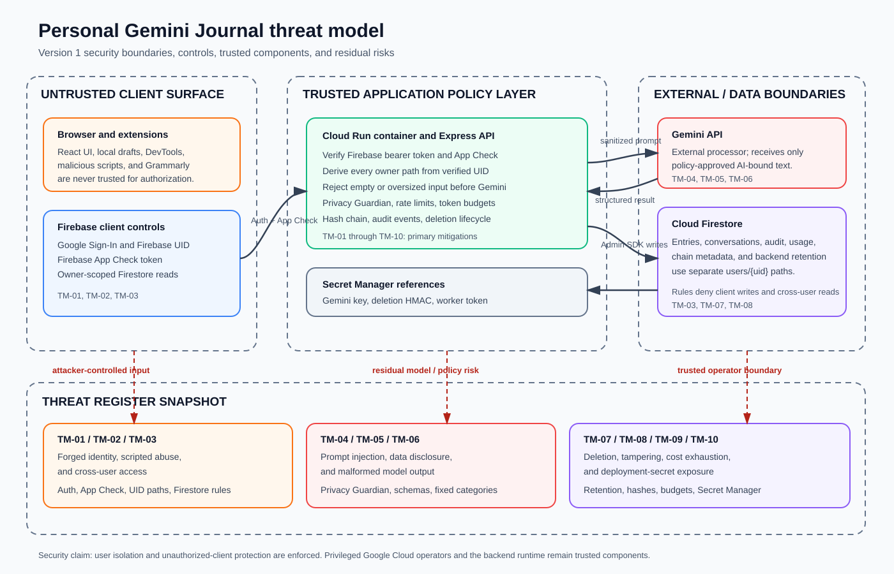

# Personal Gemini Journal Threat Model

**Version:** 1.0
**Scope:** Version 1 application and its Docker-to-Cloud-Run deployment path
**Audience:** Reviewers, maintainers, and operators

The illustration is a visual summary; the table below is the authoritative threat register.

## Security boundary

The browser is an untrusted client. Firebase Authentication supplies the user identity, Firebase App Check supplies a second application-authenticity signal, and Cloud Run is the trusted policy and persistence boundary. Gemini is an untrusted external processor from the application's point of view: it receives only the bounded input selected by the server, and its output is validated and labeled as derived content.

The application uses a trusted-backend model. Journal data is isolated per authenticated user and protected from unauthorized application clients. Privileged Google Cloud operators and the backend runtime remain trusted components and may have access to journal content through their authorized roles.

## Threat register

| ID | Threat and asset | Implemented mitigation | Residual risk and evidence |
| --- | --- | --- | --- |
| TM-01 | Forged, missing, expired, or wrong-project Firebase identity token | Cloud Run verifies the bearer Firebase ID token before `/api` routes and derives `req.uid`; client-supplied ownership fields are not trusted. | Revoked-token checks are not requested on every API call. Revisit if account takeover response requires immediate server-side revocation. Evidence: `server/src/middleware/auth.ts`. |
| TM-02 | Scripted or non-application calls to the public API | Production App Check verifies `X-Firebase-AppCheck`; Firebase Auth remains the identity control; per-user rate and token budgets limit abuse. | App Check is not a complete bot/WAF solution and must remain enforced in production. Evidence: `server/src/middleware/appCheck.ts`, `server/src/lib/rateLimiter.ts`. |
| TM-03 | Cross-user reads or client-written security records | Firestore rules permit owner-scoped reads only, deny client writes, default-deny unknown paths, and deny retention collections. The Admin SDK writes using the verified UID. | Privileged Admin SDK access remains trusted by design. Evidence: `firestore.rules`, `server/src/routes/journal.ts`. |
| TM-04 | Prompt injection in journal text or conversation replies | Journal text is framed as untrusted data; the application has no Gemini tool/function execution path; structured analysis is schema-checked against fixed categories; output is labeled DERIVED. | Prompt injection cannot be eliminated from a text-generation system. Gemini output is not authorization or an instruction to the application. Evidence: `server/src/lib/geminiClient.ts`, `docs/OWASP_LLM_TOP10_COVERAGE.md`. |
| TM-05 | Accidental disclosure of secrets or PII to Gemini | Privacy Guardian scans entry and reply text before AI calls. Redaction applies to the Gemini-bound copy while the user's RAW text remains separate. Private Journal skips Gemini entirely. | Deterministic detection is not a complete secret detector; obfuscated or novel secrets may evade it. Evidence: `server/src/lib/piiDetector.ts`, `server/src/lib/journalMode.ts`. |
| TM-06 | Malformed or harmful model output being stored as trusted data | Structured responses are parsed and validated; categories are allowlisted; retries and model fallback are bounded; model output is stored as DERIVED content. | A validly shaped response may still be low quality or inappropriate. No model output is treated as authorization or a database command. Evidence: `server/src/lib/geminiClient.ts`. |
| TM-07 | Journal content remaining visible after deletion | Individual and all-journal deletion hide active records immediately, preserve chain tombstones, move protected material to backend-only retention paths, and redact due records after the retention period. | The runtime and privileged operators can access protected records before redaction. The Scheduler worker remains an operational trust boundary. Evidence: `server/src/lib/retention.ts`, `server/src/routes/retention.ts`. |
| TM-08 | Tampering with journal history or deletion state by an ordinary client | Clients cannot write entries, conversations, audit, usage, metadata, or retention records. Server-side SHA-256 links and revalidation detect inconsistent active/tombstone chains. | Hashing provides tamper evidence, not encryption or protection from a privileged operator who can rewrite both data and hashes. Evidence: `server/src/lib/hashChain.ts`, `server/src/routes/journal.ts`. |
| TM-09 | Gemini cost exhaustion or retry amplification | Entry and reply sizes are bounded and oversized values are rejected; requests are rate-limited; daily token budgets include retries; the six-model ladder has bounded attempts. | Distributed abuse and project-level quota exhaustion require additional platform controls at larger scale. Evidence: `server/src/lib/inputValidation.ts`, `server/src/lib/rateLimiter.ts`, `server/src/lib/geminiClient.ts`. |
| TM-10 | Secret or deployment credential exposure | Gemini, deletion-HMAC, and worker-token values are injected from Secret Manager at runtime. Build and runtime identities are separate, and server secrets are excluded from frontend/build inputs. | Firebase web configuration and reCAPTCHA site keys are public client configuration, not server secrets. Human IAM and the Cloud Run runtime remain trusted. Evidence: `Dockerfile`, `cloudbuild.yaml`, `scripts/provision-cloud-run.ps1`. |

## V1 decisions and deferred hardening

The following are intentionally outside the current cohort version because they add operational or architectural scope without being required for the demonstrated user-isolation and AI-safety boundaries:

- Structured request logging with latency, route, status, model, and sanitized request correlation fields is deferred until after submission. The existing audit trail already records security events and correlation IDs.
- A separate AI provider abstraction is deferred until a second provider, Vertex AI migration, or offline test provider is required.
- A repository/data-access layer is deferred until duplicated Firestore access or multiple persistence backends justify it.
- API Gateway, WAF, and distributed abuse scoring are deferred until the application has a larger public traffic profile.
- Response caching is deferred because journal content is private and cache isolation would add privacy and invalidation complexity.
- Full revoked-token checking is deferred until immediate server-side session invalidation becomes a stated product requirement.

These are roadmap decisions, not claims that the current application has those controls. Revisit them when traffic, compliance, incident response, or provider requirements change.

## Verification references

- [OWASP LLM Top 10 coverage](OWASP_LLM_TOP10_COVERAGE.md)
- [Manual verification matrix](TEST_RESULTS.md)
- [Evaluation dossier](EVALUATION_DOSSIER.md)
- [Architecture diagram](ARCHITECTURE.svg)
